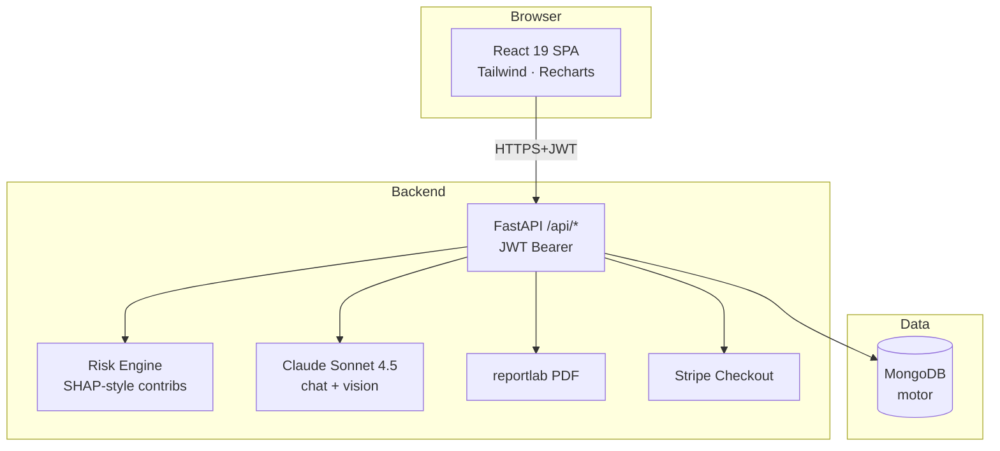

# Architecture — Aegis Health

## System overview



## Request flows

### 1. Health intelligence
1. User submits `POST /api/health/record`
2. `assemble_intelligence()` runs 5 logistic predictors → SHAP-style contribs
3. Composite scores computed (cardio · metabolic · lifestyle)
4. Mock 30-day wearable series synthesized (seeded by date)
5. Z-score anomaly detection on HR/O₂/sleep
6. Alerts + recommendations generated
7. Snapshot persisted to `disease_predictions`

### 2. AI Assistant (streaming)
```
client → POST /api/assistant/stream
       → LlmChat(claude-sonnet-4-5).stream_message()
       → SSE: data: <token>\n\n ...  data: [DONE]\n\n
       → On completion: persist full reply to assistant_messages
```

### 3. Stripe checkout
```
client → POST /api/payments/checkout {package_id, origin_url}
       → server-side price lookup (PACKAGES dict)
       → StripeCheckout.create_checkout_session()
       → insert payment_transactions {payment_status: initiated}
       → return Stripe URL
client redirected → completes on Stripe → back to /app/billing/success?session_id=...
client → POST /api/payments/status/{session_id} (polls 5x × 2s)
       → idempotent: flip user.is_premium=true on first paid response
```

## Database schema

| Collection | Key fields |
|---|---|
| `users` | id, email, password_hash, name, role, age, gender, is_premium, premium_since |
| `health_records` | id, user_id, age, gender, height_cm, weight_kg, systolic, diastolic, glucose, cholesterol, hdl, smoker, alcohol, exercise_min_week, family_history |
| `disease_predictions` | id, user_id, scores{overall,cardio,metab,lifestyle}, predictions[{disease,probability,risk,confidence,contributions,forecast}] |
| `assistant_messages` | id, user_id, session_id, user_text, assistant_text, created_at |
| `medical_documents` | id, user_id, filename, size, parsed{document_type,lab_values,medications,...} |
| `payment_transactions` | id, session_id, user_id, package_id, amount, currency, payment_status, status |

## ML pipeline (current MVP)

Each disease predictor is a calibrated logistic ensemble:

```
features = [Glucose, BMI, Systolic, Diastolic, Cholesterol, HDL,
            Age, Smoker, Alcohol, Exercise, FamilyHistory]
contribution_i = (feature_i - baseline_i) / scale_i × weight_i
score = bias + Σ contribution_i
probability = sigmoid(score)
risk_category = Low (<0.25) / Moderate (<0.5) / High (<0.75) / Critical
```

Per-feature contributions are surfaced verbatim as the SHAP-style explainability output.

## Security

- **JWT** with 7-day expiry, `HS256`, secret in env
- **bcrypt** password hashing (cost 12 default)
- **RBAC** via `require_role()` dependency
- **Payments**: prices defined server-side only · idempotent upgrades · auth required on all billing endpoints
- **CORS** wildcard in dev → narrow to your domain in prod
